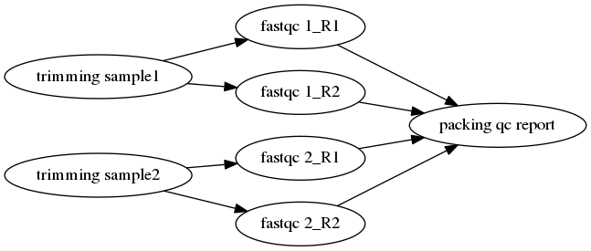
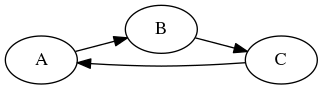

j2pbs ---- Write pbs jobs in JSON format.
=========================================


[](https://pypi.python.org/pypi/j2pbs/0.1.1)


[JSON](http://www.json.org/) is a simple and readble file format
for data transfer and configuration.
What if we using it organize our 
PBS([Portable Batch System](https://en.wikipedia.org/wiki/Portable_Batch_System)) jobs?
Maybe this will make it easier to submit and manage our PBS jobs.
j2pbs is a python package and command line tools help you doing such things.

## Installation
```
pip install j2pbs
```

## Example:

Firstly, we begin with a very simple example:

Here, we want submit two job, the first job is just `sleep 10` seconds,
and the second one just `echo Hi!`,
the second job is depend on the first,
it means that the second job begin to run when the first job terminate normally.
This is the simplest dependence relationship.


### A simple example

We can express these two jobs like following json file:
```
{
    "name": "simple example",
    "jobs": 
     [
        { "id": 0, "name": "job1", "cmd": "sleep 10" },
        { "id": 1, "name": "job2", "cmd": "echo Hi!", "depend": 0 }
     ]
}
```

Assume we store this in the file "simple.json".
Next, we can submit these jobs using the command line interface:
```
$ python -m j2pbs submit simple.json
1032924.admin
1032925.admin

$ qstat
Job ID                    Name             User            Time Use S Queue
------------------------- ---------------- --------------- -------- - -----
1032924.admin              job1             user                   0 Q batch
1032925.admin              job2             user                   0 H batch

$ # waitting job2 end ...

$ cat job2.o1032925
Hi!

```

We can see that the jobs has run correct according to the dependence relationship.
Actually, we can break down this process to two single steps, it has the same effect:
```
$ # first convert the json config file to one control bash script.
$ python -m j2pbs convert simple.json simple.sh
$ # then run the control script
$ bash simple.sh
...
```

Of course, you can also do these within Python.

``` python
>>> import json
>>> from j2pbs.model import Graph
>>> from j2pbs.pbs_utils import qsub
>>> with open("./simple1.json") as f:
...     js_str = f.read()
... 
>>> js_dict = json.loads(js_str)
>>> g = Graph(js_str)
>>> qsub(g.contorl_script)
...
```
### A real world example
Then we look a real world example: rna-seq data preprocessing. 



json file:
```
{
    "name": "rna-seq-preprocessing",
    "dir": "$HOME/example-rnaseq",
    "shell": true,
    "resources": { "nodes": 1, "ppn": 1 },
    "var":{
        "trimm": "java -jar $HOME/S/Bioinfo/Trimmomatic-0.36/trimmomatic-0.36.jar",
        "fastqc": "$HOME/S/Bioinfo/FastQC/fastqc"
    },

    "jobs": 
    [
        {
            "id": 0, "name": "trimming_1",
            "resources": { "nodes" : 1, "ppn": 2 },
            "cmd": "$trimm -threads 2 -phred33 1_R1.fq.gz 1_R2.fq.gz 1_R1.clean.fq.gz 1_R1.unpair.fq.gz 1_R2.clean.fq.gz 1_R2.unpair.fq.gz ILLUMINACLIP:adapters.txt:3:30:5 MINLEN:100"
        },

        {
            "id": 1, "name": "trimming_2",
            "resources": { "nodes" : 1, "ppn": 2 },
            "cmd": "$trimm -threads 2 -phred33 2_R1.fq.gz 2_R2.fq.gz 2_R1.clean.fq.gz 2_R1.unpair.fq.gz 2_R2.clean.fq.gz 2_R2.unpair.fq.gz ILLUMINACLIP:adapters.txt:3:30:5 MINLEN:100"
        },

        { "id": 2, "name": "fastqc_1_R1", "cmd": "$fastqc 1_R1.clean.fq.gz", "depend": 0 },
        { "id": 3, "name": "fastqc_1_R2", "cmd": "$fastqc 1_R2.clean.fq.gz", "depend": 0 },
        { "id": 4, "name": "fastqc_2_R1", "cmd": "$fastqc 2_R1.clean.fq.gz", "depend": 1 },
        { "id": 5, "name": "fastqc_2_R2", "cmd": "$fastqc 2_R2.clean.fq.gz", "depend": 1 },


        {
            "id": 6, "name": "packing_qc_reports",
            "cmd": [
                "mkdir qc_report",
                "cd qc_report",
                "tar -zcvf result.tar.gz ./*.clean.fq.gz *.html"
            ],
            "depend": [2, 3, 4, 5]
        }
    ]
}
```

## Grammar
The json file to be used must contain one "Graph", it's an object,
represent the relation between jobs.

Graph:

Field     | Necessary | Type      | Description
-----     | --------- | ----      | -----------
name      | T         | String    | the name of this graph
jobs      | T         | Array[Job]| a list of jobs
dir       | F         | String    | default path of jobs
resources | F         | Object    | default resources of jobs
queue     | F         | String    | default queue of jobs 
shell     | F         | Boolean   | use shell variable or not
var       | F         | Object    | global variables 

Job:

Field     | Necessary | Type      | Description
-----     | --------- | ----      | -----------
id        | T         | Number    | job identifier
name      | T         | String    | job name
cmd       | T         | Array[String] / String | commands or one command to be execute
queue     | F         | String    | the queue of the job
dir       | F         | String    | path
resources | F         | Object    | resources to be use
shell     | F         | Boolean   | use shell variable or not
var       | F         | Object    | local variables
depend    | F         | Number / Array[Number] | the depended jobs's id

resources:

Field | Type      | Description
----- | ----      | -----------
nodes | Number    | how many nodes to be use
ppn   | Number    | cores per node
...

## Features:
### variables suport
j2pbs allow you define variables use the 'var' field,
and you can use it in the 'cmd' and 'dir' fields.

There are three kinds of 
variables:
+ local (job level)
+ global (graph lebel)
+ shell (shell environment)

Priority: local > global > shell

#### 1. Job level variables
For example:
```
{
    "id": 0,
    "name": "var_test",
    "var": {"greet": "Hello World!"},
    "cmd": "echo $greet"
}
```
This pbs job will output "Hello World!" to stdout.

#### 2. Global level variables
```
{
    "name": "var_test",

    "var":
    {
        "person1": "Alice",    
        "person2": "Bob"
    },

    "jobs": 
     [ 
        { "id": 0, "name": "hello1", "cmd": "echo Hi $person1" },
        { "id": 1, "name": "hello2", "cmd": "echo Hi $person2" }
     ]
}
```

#### 3. Shell variables
Use `"shell": true` to permeate the shell environment variables.
For example:
```
{
    "name": "var_test",
    "shell": true,
    "jobs":
    [
        {"id":0, "name": "hello", "cmd": "echo $USER"}
    ]
}
```

#### Escape char
The escape char in j2pbs is '^', if it ahead of a variable, it will be seem as literal string. For example:
```
{
    "name": "var_test",
    "shell": true,
    "jobs":
    [
        {"id":0, "name": "hello", "cmd": "echo ^$USER"}
    ]
}
```
This job will not output the user name, but the literal string "$USER".

### Loop dependence detection
If there are loop dependence relationship within jobs, j2pbs will raise a `GraphLoopDependent` exception. For example:
```
$ cat loop.json
{
    "name": "loop-example",
    "jobs": 
    [
        {"id":0, "name":"a", "cmd":"echo a", "depend": 2},
        {"id":1, "name":"b", "cmd":"echo b", "depend": 0},
        {"id":2, "name":"c", "cmd":"echo c", "depend": 1}
    ]
}
```

These jobs's relation like this:



It will raise exception when convert it.

```
$ python -m j2pbs convert loop.json
Traceback (most recent call last):
  File "/home/nanguage/S/anaconda2/lib/python2.7/runpy.py", line 174, in _run_module_as_main
    "__main__", fname, loader, pkg_name)
  File "/home/nanguage/S/anaconda2/lib/python2.7/runpy.py", line 72, in _run_code
    exec code in run_globals
  File "/home/nanguage/S/anaconda2/lib/python2.7/site-packages/j2pbs/__main__.py", line 88, in <module>
    main()
  File "/home/nanguage/S/anaconda2/lib/python2.7/site-packages/j2pbs/__main__.py", line 82, in main
    args.func(args)
  File "/home/nanguage/S/anaconda2/lib/python2.7/site-packages/j2pbs/__main__.py", line 59, in convert
    f.write(g.control_script)
  File "/home/nanguage/S/anaconda2/lib/python2.7/site-packages/j2pbs/model.py", line 337, in control_script
    raise GraphLoopDependent()
j2pbs.exceptions.GraphLoopDependent: There are loop in dependent relationship.

```

## TODO
1. More pbs features
2. Provide the api for visualize the jobs dependence relationship, such as:
generate DOT file or draw it in ascii.
